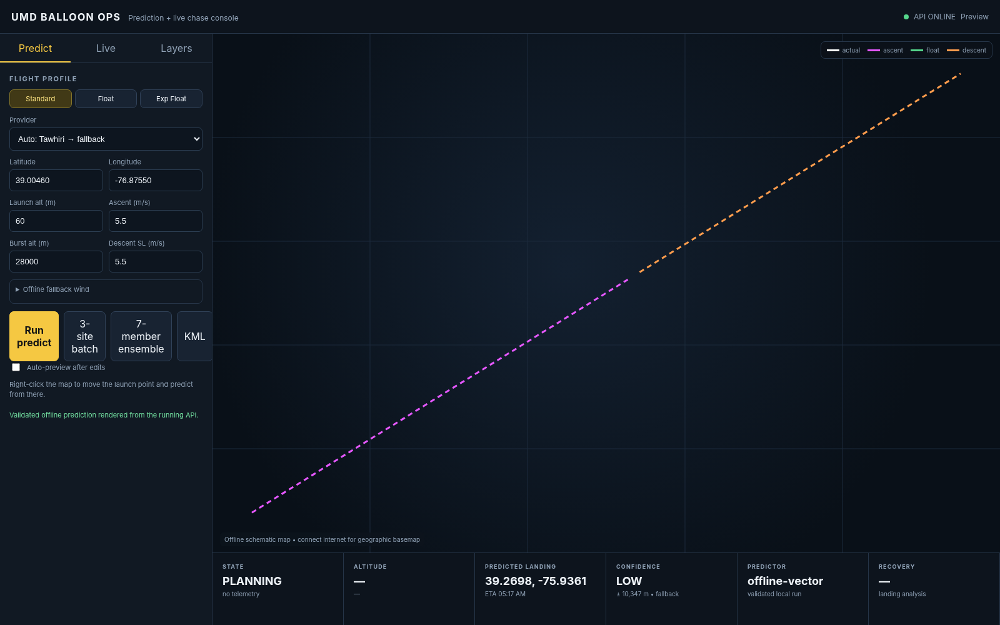

# UMD Balloon Ops



A clean-room, modular replacement for the older UMD `BalloonPredictionMap`: preflight prediction + live high-altitude-balloon chase + recording/replay + recovery analysis in one local web app.

## Start here

### macOS
1. Install Python 3.11+.
2. Double-click `run.command` (or run `./run.command` in Terminal).
3. Open **http://127.0.0.1:8000**.

### Windows
1. Install Python 3.11+ and check **Add Python to PATH**.
2. Double-click `run.bat`.
3. Open **http://127.0.0.1:8000**.

### Linux
```bash
python3 -m venv .venv
source .venv/bin/activate
pip install -r requirements.txt
./run.sh
```

### Docker
```bash
docker build -t umd-balloon-ops .
docker run --rm -p 8000:8000 umd-balloon-ops
```

## First test

The Predict tab opens at UMD College Park. Choose:

- **Auto**: live Tawhiri first, then true local GFS if configured, then emergency vector fallback.
- **Tawhiri only**: fail rather than silently using a fallback.
- **Local GFS / CUSF**: true offline weather-model prediction when configured.
- **Emergency vector**: deterministic, no-network test/failsafe model; **not weather-aware**.

Click **Run predict**. You can also:

- right-click the map to predict from another launch point;
- run the three-site prediction batch concurrently;
- run a 7-member sensitivity ensemble;
- switch between Standard, Float and Experimental Float;
- export the latest trajectory as KML.

If the machine has no internet, the UI still starts and renders a schematic trajectory. Auto mode falls back instead of becoming unusable.

## Live-flight test

Open **Live** and click **Start demo flight**. The built-in simulator advances flight time 60x faster than wall time. The backend will:

1. record every telemetry fix in SQLite;
2. compute a smoothed vertical rate with a regression window;
3. infer PRELAUNCH / ASCENT / FLOAT / DESCENT / LANDED;
4. repredict only after meaningful elapsed time, altitude movement or state change;
5. push telemetry/predictions to the browser over a WebSocket;
6. keep the actual track separate from predicted trajectory;
7. persist the flight for later replay and benchmarking.

After enough data is stored, use **Replay stored** or **Benchmark stored**.

## Telemetry inputs

All sources normalize into the same `TelemetryPoint` model. Raw histories stay source-specific; the flight engine does **not blindly average GPS fixes**. It selects a fresh high-quality primary fix and warns when independent sources disagree by more than 1.5 km.

### SondeHub Amateur
Enter a callsign and click **Watch SondeHub**. The adapter polls the SondeHub Amateur telemetry API and feeds new fixes into the same fusion/flight engine.

### APRS-IS
Install the normal requirements (which include `aprslib`), then enter the payload callsign, APRS login callsign and passcode. The adapter uses `rotate.aprs2.net:14580` with a callsign filter.

### SPOT
Enter the SPOT shared-feed ID. Polling is limited to >=150 seconds so the application does not over-poll the public shared-feed API.

### Iridium / BITS-style satellite messages

POST a normalized fix to:

```text
POST /api/webhook/iridium
```

Example JSON:

```json
{
  "callsign": "UMD-130",
  "latitude": 39.21452,
  "longitude": -77.14321,
  "altitude_m": 18234,
  "timestamp": "2026-08-26T02:00:00Z",
  "battery_v": 4.02,
  "source_id": "BITS",
  "extra": {"sequence": 81}
}
```

If your Iridium/BITS decoder uses a different vendor payload, adapt only this boundary; the rest of the software is unchanged.

### Manual / custom radios

Any local decoder can POST the common telemetry model to:

```text
POST /api/telemetry/ingest
```

This is the intended integration point for LoRa, a local SDR decoder, serial radio software, etc.

## Prediction providers

### Tawhiri
The default live endpoint is:

```text
https://tawhiri.v2.sondehub.org/api/v1/
```

The client uses timeouts, status checking, JSON validation, retries/backoff and cancellation-friendly async I/O.

### True offline GFS / CUSF

This project includes a real optional adapter for the same CUSF predictor wrapper approach used by ChaseMapper. It does **not** pretend the emergency vector model is equivalent to GFS.

Install the optional dependencies:

```bash
pip install -r requirements-gfs.txt
```

You also need a compiled CUSF predictor binary (`pred` on macOS/Linux, `pred.exe` on Windows). Then download GFS data, for example around Maryland:

```bash
./scripts/download_gfs.sh 39.0 -77.0 ./gfs
```

Configure paths before starting the app:

```bash
export CUSF_PRED_BINARY=/absolute/path/to/pred
export GFS_DIRECTORY=/absolute/path/to/gfs
./run.sh
```

On Windows use environment variables with equivalent absolute paths.

Health status at `/api/health` reports whether local GFS is actually ready. Auto provider order is:

```text
Tawhiri -> local CUSF/GFS -> emergency vector
```

### Emergency vector fallback

Always available. It uses the requested fallback wind vector and balloon vertical model. Its warning and LOW confidence are intentional. During a live descent it starts directly from the current descending fix instead of inventing another ascent.

## Prediction optimization

- Multi-site and ensemble jobs are asynchronous and concurrency-limited (`MAX_PARALLEL_PREDICTIONS`, default 4).
- Prediction cache avoids duplicate requests for 25 seconds by default.
- Live predictions trigger on state changes, >=250 m altitude movement, or >=30 s elapsed—not every packet.
- UI auto-preview is debounced 450 ms.
- Recovery lookups are spatially rounded and cached for 3 minutes.
- FAA viewport data is cached for 5 minutes.

Environment overrides:

```text
BALLOON_DB
TAWHIRI_URL
SONDEHUB_API
REQUEST_TIMEOUT_S
PREDICTION_CACHE_S
AUTO_PREDICT_MIN_SECONDS
AUTO_PREDICT_MIN_ALTITUDE_DELTA_M
MAX_PARALLEL_PREDICTIONS
SONDEHUB_POLL_SECONDS
OFFLINE_TILES_PATH
CUSF_PRED_BINARY
GFS_DIRECTORY
```

## Airspace, geofences, recovery

- FAA Class Airspace is loaded by current viewport through the backend.
- FAA Special Use Airspace (SUA) is optional in the Layers tab.
- `data/geofences.geojson` is a normal editable GeoJSON FeatureCollection for mission-specific exclusion/caution areas.
- The UI links directly to the FAA TFR site. TFR data should still be checked as part of formal preflight planning; the application does not claim its static/map overlays replace official NOTAM/TFR checks.
- Recovery analysis combines USGS 3DEP point elevation/local slope, Maryland statewide parcel intersection, and approximate nearest non-private drivable OpenStreetMap way when those services are reachable.
- Parcel display intentionally excludes owner-name fields. Recovery output is a planning aid, not permission to enter private property.

## Offline maps

If you have XYZ PNG tiles stored as:

```text
/path/to/tiles/{z}/{x}/{y}.png
```

set:

```bash
export OFFLINE_TILES_PATH=/absolute/path/to/tiles
```

The backend serves them at `/offline-tiles/{z}/{x}/{y}.png`. If Leaflet itself cannot load from its CDN, the page still provides a local schematic track/prediction view.

## Ensemble uncertainty

The **7-member ensemble** perturbs ascent rate, descent rate, target altitude and (for the emergency model) wind assumptions. It runs members concurrently under the same semaphore and reports a P90 landing spread. This is a deterministic sensitivity envelope—not a calibrated probabilistic weather ensemble.

## Historical benchmarking

`GET /api/benchmark/{callsign}?provider=offline&max_samples=10` samples points from a recorded flight, re-runs predictions from those moments, and reports prediction error against the final recorded position. Only interpret that as true landing accuracy when `landed_likely` is true.

## API highlights

FastAPI automatically exposes interactive docs at:

- `http://127.0.0.1:8000/docs`
- `http://127.0.0.1:8000/redoc`

Important endpoints:

```text
POST /api/predict
POST /api/predict/batch
POST /api/predict/ensemble
POST /api/telemetry/ingest
GET  /api/telemetry/{callsign}/history
GET  /api/telemetry/{callsign}/snapshot
POST /api/watch
POST /api/watch/spot
POST /api/watch/aprs
POST /api/webhook/iridium
POST /api/simulate/start
POST /api/replay/{callsign}
GET  /api/benchmark/{callsign}
GET  /api/airspace
GET  /api/geofences
GET  /api/recovery
WS   /ws/live
```

## Data storage

SQLite lives at `data/balloon_ops.sqlite3` by default and uses WAL mode. Delete that file to reset local flight history, or set `BALLOON_DB` to another path.

## Tests

```bash
pytest -q
```

The shipped suite currently contains 8 tests covering server health, Standard/Float/Experimental-Float fallback prediction, live flight-state inference, API prediction, ensemble generation, descending-flight behavior and source-aware fusion/disagreement alerts.

## What still depends on outside systems

The application is fully runnable without accounts or internet because simulation, storage/replay and emergency predicts are local. The following capabilities inherently require something external:

- Tawhiri: internet access.
- SondeHub: internet + a callsign present in SondeHub Amateur.
- SPOT: a valid shared-feed ID.
- APRS-IS: an APRS login callsign/passcode and network access.
- Iridium/BITS: your payload/gateway must POST decoded coordinates to the webhook.
- True offline GFS: `cusfpredict`, the compiled CUSF predictor binary and downloaded GFS data.
- Geographic basemap/FAA/USGS/parcel/OSM recovery layers: internet unless the relevant data is cached/provided locally.

Those boundaries are intentional: unavailable sources degrade independently instead of taking down the flight engine.
